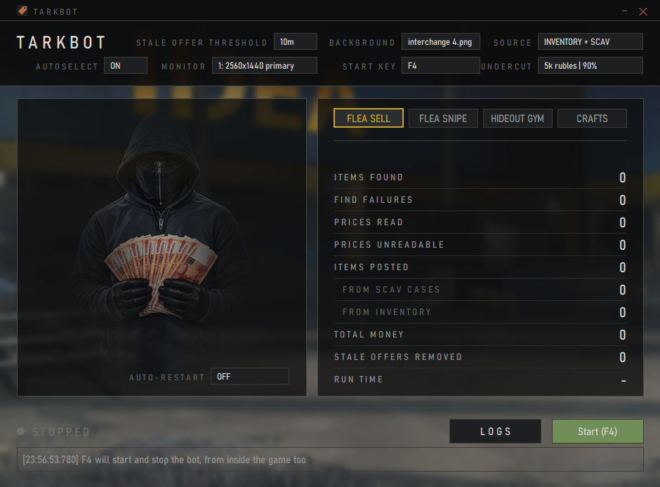

# Tarkbot

A flea market bot for Escape From Tarkov. It reads your screen, picks an item out of your
stash, reads the price Tarkov suggests, undercuts it, and lists it. Then it does the next one,
and keeps going until you press Stop.



No memory reading, no injection, no files touched. It looks at the game window the way you do
and clicks where you would click.

## Install and run

1. Grab the latest `tarkbot-<version>-win64.msi` from
   [Releases](https://github.com/matthewmiglio/TarkBot/releases).
2. Run the installer, then launch **Tarkbot** from the Start menu.
3. Have Tarkov open, in fullscreen, sitting on your stash screen.
4. Pick where items come from (your inventory, scav cases, or both), pick a background if you
   care, press **Start**.

You get 3 seconds after Start to get out of the way. The lamp goes green while it works, red if
a pass lands on a screen it did not expect, and it just starts a fresh pass from there. Stop
lands mid-pass, not at the end of one, so it stops when you press it.

Windows only. The bot talks to the Tarkov window through user32 directly, so there is no macOS
or Linux build and there is not going to be one.

## Lay of the land

```
app/          The bot and its GUI. This is the thing that ships.
website/      Next.js marketing site.
dashboard/    Next.js dashboard.
```

Everything worth knowing about the bot itself is in [`app/CLAUDE.md`](app/CLAUDE.md): what each
module does, how items are found, how the price reader works, and how the tests run. Short
version:

- **Finding things** is template matching. Every button lives as a cropped screenshot under
  `app/interact/reference_images/<target>/`, and `find.py` looks for it inside the game window.
- **Reading prices** is not OCR. Tarkov prints prices in a fixed bitmap font, so `ocr.py` cuts
  the number into glyphs and pixel-matches each one. It returns nothing rather than a guess,
  because a half-read price is a wrong price. A real OCR engine was tried first and read 999 as
  666 at full confidence.
- **Undercutting** takes the higher of a percentage off and a flat amount off, so the flat cut
  wins on expensive items and the percentage wins on cheap ones. The GUI's UNDERCUT dropdown
  picks the flat cut: 2000, 3000 or 5000 roubles, always against the same 15%.

## Running from source

```
cd app
pip install -r requirements.txt
python -m gui.app
```

Requires Python 3.11+. The tests are not pytest, they are scripts that run against the live
game and write a picture of what they saw to `app/tests/output/`. Two of them need no game at
all: `python tests/test_price_corpus.py` and `python -m interact.sell`.

## Building an installer

```
cd app
python scripts/setup_msi.py bdist_msi --target-version v0.0.0-local
```

Releases are cut by pushing a `vX.Y.Z` tag. The tag is the only place a version number exists.

## Fair warning

Automating Tarkov is against BSG's rules and can get your account banned. Your account, your
call.
